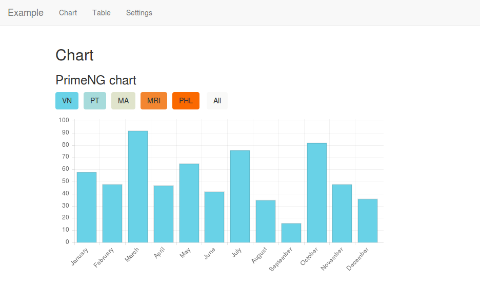
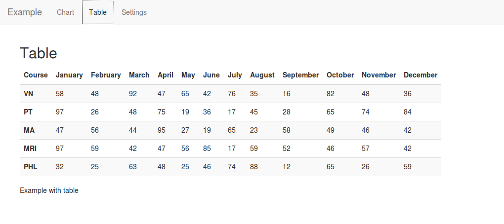
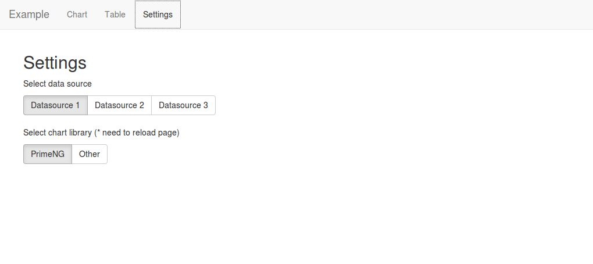

# Angular2 and PrimeNG example

## What is this?

It is example of Angular2 application with nested routes, nested components.

There are three pages

### Chart



### Table



### Settings



## Installation

Instruction for Debian/Ubuntu.

Clone this repository:

```
git clone git@github.com:mnvx/angular2-primeng-example.git
```

Run

```
npm install
```


Installation completed.

## How to run

Use PHP 5.4+. Run command from path where project was installed: 

```
php -S localhost:8000 -t public/ public/index.php
```

Then open url http://localhoost:8000
